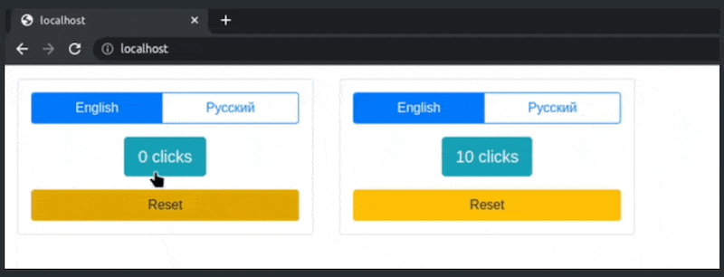

This project expands on the [en-ru-click-counter](https://github.com/roman-usov/en-ru-click-counter) project. This time the app can support more than one multilingual counters on the same page. 

The template has two click counter containers. Each click counter has its own state, i.e. changes in one counter do not affect the other counter.

## Demo

